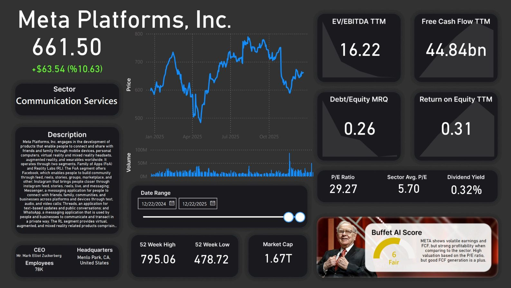
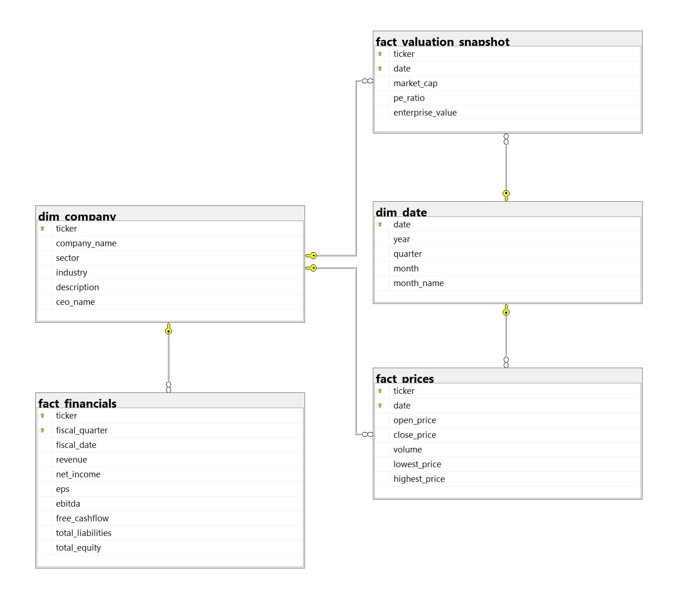

# Value Investing Stock Dashboard
## A Python -> SQL Server -> PowerBI ETL Pipeline based off of Yfinance API data that visualizes key value-based investing metrics

## This dashboard includes
* A Detailed Stock Chart
* Key Company Information
* Key Value Investing Metrics
* A Brief AI Generated Buffet Analysis

## Tech Stack
* `Language` - Python (yfinance, pandas, SQLAlchemy)
* `AI` - Google Gemini 2.0 Flash
* `Database` - SQL Server (Star Schema)
* `Visualization` - PowerBI, Figma

## Repository Structure
* `Script` - User input through terminal, ETL of Yfinance API Data into SQL 
* `Database` - The SQL Server (Must be made first)
* `Dashboard` - PowerBI dashboard connected to SQL Server, main visuals
* `Images` - Visuals of completed PowerBI Dashboard along with UI of dashboard created in Figma

## The Pipeline Flow

Stock ticker is inputted in `stockanalysisdashboard.py` terminal, data extracted from yfinance and partly Gemini AI(sector average P/E and PEG ratio), then transformed, and loaded into star structured SQL Server database. SQL Server data is then connected to PowerBI through DirectQuery and outputted into clean and precise visuals.

***Note on Setup: While the data flows from python to SQL, you must initialize the SQL DB first with the `FinancialAnalysisDBIntitialization` query first.***

## 1. User Input and YFinance ETL in Python
The user inputs a public company's stock ticker, upon that, a connection is established to the server, and the database is cleared of any existing data from previous stock entries. The script's sections are divided by their entry into the SQL database. The main chunk of code consists of extracting data from yfinance, and transforming it to fit into the SQL database. Additionally, within the script, implementation of Gemini 2.0 for sector-average P/E and PEG ratios. Gemini 2.0 is also used for "Warren AI", which takes the input gathered from yfinance, analyzes it, and determines whether a stock is overvalued or not and gives reasoning.

## 2. Star SQL Schema for Seamless PowerBI Integration

### The schema consists of five tables
* `dim_company` - Description of the company
* `dim_date` - The timeframe of the database (Derived from date range of historical stock prices)
* `fact_prices` - Historical daily open and close prices of the stock
* `fact_valuation_snapshot` - Contains snapshot info about the stock
* `fact_financials` - Contains data from the past 4 quarterly earnings

## 3. PowerBI and Figma Visuals
The SQL Server database is connected to PowerBI through DirectQuery, and finally outputs the data within the dashboard. The background of the dashboard was created in Figma, and the 4 value metrics in the top right were calculated by using DAX and outputting them to KPI cards. There is an interactive chart timeframe slider that shows historical stock prices and volume, in addition to key company information.

